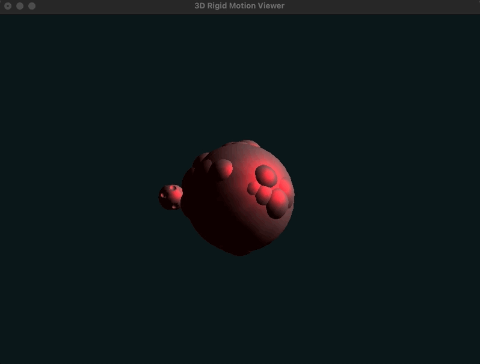

# CSE 167 Rigid Motion Final Project 🌎

---

Simulate Rigid-Body Motion (Translation and Rotation) in 3D 🌎

**Partners**: Jonathan Zamora-Anaya and Shunkai Yu

**Instructions**: Run `make && ./SceneViewer` to execute the simulation

> 
> **Figure 1: Planets with Lighting**

> 
> **Figure 2: Simple First-Order Method Algorithm**

> 
> **Figure 3: Buss’ Augmented Second-Order Method Algorithm**
